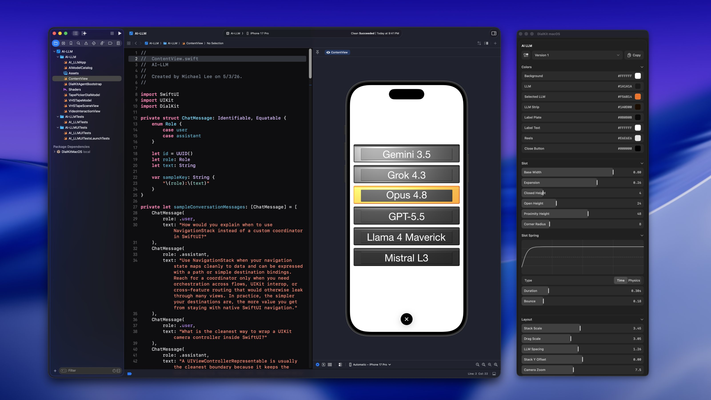

# Dialkit macOS

Dialkit macOS is a Mac app for tuning your iOS interface live. Your app runs in the iOS Simulator or an Xcode Preview, the inspector runs on your Mac, and every slider, color, and spring you interact with updates the app in real time.

> **Beta:** This repository is currently a work in progress.



## Credit

This Swift package is based on the original [DialKit repository](https://github.com/joshpuckett/dialkit) by [Josh Puckett](https://github.com/joshpuckett).

[Installation](#installation) · [Quick start](#quick-start) · [Running the inspector](#running-the-inspector) · [Controls](#controls) · [Troubleshooting](#troubleshooting)

## Overview

Tuning values inside a phone-sized screen means the controls cover the thing you are tuning. Moving the controls to a Mac window gives you a full-size panel with proper sliders, a real color picker, and text fields you can actually type in, while you keep an unobstructed view of your app. The inspector UI runs in a separate process; the agent is started only in debug builds in the examples below.

If you would rather have the dials inside your app as a drawer, take a look at the complementary package, [dialkit-ios](https://github.com/mikelikesdesign/dialkit-ios). Both packages share the same way of describing controls, so you can move between them easily.

## How it works

1. Add this package to your app and start the debug agent.
2. Describe the values you want to tune with a `DialPanelState`, and use `dial.values` when rendering your interface.
3. Run the inspector on your Mac and edit the panel it receives.
4. Copy the values you want to keep and apply them to your model’s defaults in source code.

The agent connects to the inspector over localhost, sends it your panels, and applies edits as they come back. The inspector accepts connections only on loopback, and the agent reconnects automatically after either process restarts. Your app needs this integration to expose controls; the inspector cannot discover tunable values in an arbitrary app.

## Requirements

- macOS 14 or later to build and run the inspector
- Xcode 15.3 or later with Swift 5.10 or later
- An iOS 17 or later app running in the Simulator or Xcode Previews, or a local macOS 14 or later app
- Swift app code using SwiftUI, UIKit, or AppKit; Objective-C apps need a Swift bridge
- A model type that conforms to `Codable` and `Equatable`

## Installation

In Xcode, open your app project and choose **File → Add Package Dependencies…**. Enter this repository URL:

```text
https://github.com/mikelikesdesign/dialkit-macos
```

Add the dependency and select your app target for both products:

- `DialkitmacOS` – the tuning API
- `DialkitmacOSAgent` – the bridge to the inspector, which you start only in debug builds

Use `import DialkitmacOS` in files that define panels. The module and product names are case-sensitive. This workflow needs no in-app drawer or `DialRoot`.

### Start the agent

For SwiftUI, add the following startup code to your existing `App` type. Replace `MyApp` and `ContentView` with your app’s names; keep only one `@main` entry point:

```swift
import SwiftUI

#if DEBUG
import DialkitmacOSAgent
#endif

@main
struct MyApp: App {
    init() {
        #if DEBUG
        DialKitAgent.shared.start(appName: "MyApp")
        #endif
    }

    var body: some Scene {
        WindowGroup {
            ContentView()
        }
    }
}
```

For an isolated Xcode Preview, start the agent in the preview’s `.task` as well, since the app’s startup code may not run. Keep the guarded `DialkitmacOSAgent` import in that file:

```swift
#Preview {
    ContentView()
        .task {
            #if DEBUG
            DialKitAgent.shared.start(appName: "ContentView Preview")
            #endif
        }
}
```

Calling `start()` more than once with the same host and port is safe: the agent keeps a single connection and updates the app name if needed. `DialKitAgent` runs on the main actor; call it from your app’s main-thread startup or a `@MainActor` context. For UIKit startup, see the [UIKit example](#uikit).

## Quick start

After starting the agent, add this model and view to your app. Present `CardPreview()` in your `WindowGroup`, or use it in the `#Preview` above. Every control below reads and writes a property that the view actually uses:

```swift
import DialkitmacOS
import Foundation
import SwiftUI

struct CardModel: Codable, Equatable {
    var title = "Card"
    var cornerRadius = 24.0
    var opacity = 1.0
    var isEnabled = true
    var fill = "#F97316"
}

struct CardPreview: View {
    @StateObject private var dial = DialPanelState(
        name: "Card",
        initial: CardModel(),
        controls: [
            .text("title", keyPath: \.title),
            .slider("cornerRadius", keyPath: \.cornerRadius, range: 0...48, step: 1, unit: "pt"),
            .slider("opacity", keyPath: \.opacity, range: 0...1, step: 0.05),
            .toggle("isEnabled", keyPath: \.isEnabled),
            .color("fill", keyPath: \.fill)
        ]
    )

    var body: some View {
        RoundedRectangle(cornerRadius: dial.values.cornerRadius)
            .fill(dial.values.isEnabled ? cardColor(dial.values.fill) : Color.gray)
            .opacity(dial.values.opacity)
            .overlay {
                Text(dial.values.title)
                    .foregroundStyle(.white)
            }
            .padding(40)
    }
}
```

Color controls store hex strings. Add this helper alongside `CardPreview` to convert the supported formats to SwiftUI colors (`#RRGGBBAA` has alpha in the last two digits):

```swift
private func cardColor(_ hex: String) -> Color {
    var digits = hex.hasPrefix("#") ? String(hex.dropFirst()) : hex
    if digits.count == 3 {
        digits = digits.map { "\($0)\($0)" }.joined()
    }
    guard (digits.count == 6 || digits.count == 8),
          let value = UInt64(digits, radix: 16) else {
        return .orange
    }

    let hasAlpha = digits.count == 8
    let rgb = hasAlpha ? value >> 8 : value
    return Color(
        .sRGB,
        red: Double((rgb >> 16) & 0xFF) / 255,
        green: Double((rgb >> 8) & 0xFF) / 255,
        blue: Double(rgb & 0xFF) / 255,
        opacity: hasAlpha ? Double(value & 0xFF) / 255 : 1
    )
}
```

[Run the inspector](#running-the-inspector), then launch your app or resume the preview. A **Card** panel should appear. Change **Corner Radius**, **Title**, or **Fill** and confirm the card updates. Values you hard-code in the view instead of reading from `dial.values` will not respond to inspector edits.

### UIKit

In your existing app delegate, start the agent during launch. Add the guarded import at the top of the file and merge this into `application(_:didFinishLaunchingWithOptions:)`:

```swift
#if DEBUG
import DialkitmacOSAgent
#endif

func application(
    _ application: UIApplication,
    didFinishLaunchingWithOptions launchOptions: [UIApplication.LaunchOptionsKey: Any]?
) -> Bool {
    #if DEBUG
    DialKitAgent.shared.start(appName: "MyApp")
    #endif
    return true
}
```

Keep the panel in a view controller or model object, observe `dial.$values`, and apply the changes to your views. This example uses the `CardModel` defined above:

```swift
import Combine
import DialkitmacOS
import UIKit

final class CardViewController: UIViewController {
    private var cancellables: Set<AnyCancellable> = []
    private let titleLabel = UILabel()

    private let dial = DialPanelState(
        name: "Card",
        initial: CardModel(),
        controls: [
            .text("title", keyPath: \.title),
            .slider("cornerRadius", keyPath: \.cornerRadius, range: 0...48, step: 1)
        ]
    )

    override func viewDidLoad() {
        super.viewDidLoad()
        view.backgroundColor = .systemOrange
        view.clipsToBounds = true
        titleLabel.frame = CGRect(x: 24, y: 40, width: 240, height: 40)
        titleLabel.autoresizingMask = [.flexibleWidth]
        view.addSubview(titleLabel)

        dial.$values
            .receive(on: DispatchQueue.main)
            .sink { [weak self] values in
                self?.apply(values)
            }
            .store(in: &cancellables)
    }

    private func apply(_ values: CardModel) {
        titleLabel.text = values.title
        view.layer.cornerRadius = CGFloat(values.cornerRadius)
    }
}
```

Present this controller through your existing scene or navigation setup. AppKit apps can use the same observation pattern with `NSView` updates and start the agent from `applicationDidFinishLaunching(_:)`.

## Running the inspector

Clone this repository and run the inspector from the checkout:

```sh
git clone https://github.com/mikelikesdesign/dialkit-macos.git
cd dialkit-macos
swift run dialkit-macos
```

The inspector uses the original DialKit artwork as its Dock icon. To create a
local app bundle with the Finder icon as well, run `bash Scripts/package-app.sh`.
The app is written to `.build/package-app/Dialkit macOS.app`.

Run these commands in Terminal on your Mac. The first run compiles the inspector; later runs reuse the build when possible. Keep the process running while you tune. Launch your app or resume your preview, and the panel appears. Stop the inspector with **Control-C** in Terminal.

You can also launch it with the helper command `swift run dialkit run` from the checkout. No separate `.app` download is required. If nothing shows up, check the status at the bottom of the inspector’s empty state and the [troubleshooting table](#troubleshooting).

The inspector starts in dark mode by default. Scroll to the last control in the panel and use **Dark Mode → Off / On** to choose light or dark mode. Your choice is remembered across launches and changes only the inspector’s appearance, not the app you are tuning. The switch is also available in the disconnected view.

The inspector listens on `127.0.0.1:44777`. The app and inspector must run on the same Mac. Physical iPhones and iPads are not supported by this loopback workflow. Run only one inspector instance at a time.

Rebuild both the inspector and your app after updating the package so their message formats match. Invalid numeric controls are omitted with a status log while other controls continue updating.

## Example app

The [demo app](Examples/DialKitDemo/DialKitDemo/ContentView.swift) uses a local package reference to this checkout, so no extra dependency setup is needed:

1. From the repository root, run `open Examples/DialKitDemo/DialKitDemo.xcodeproj`.
2. Select the **DialKitDemo** scheme and an iOS Simulator, then run the app (**Command-R**).
3. In Terminal, run `swift run dialkit-macos` from the repository root.
4. Edit the **Card** panel. Try **Title**, **Layout → Corner Radius**, **Appearance → Fill**, and **Motion → Bounce**.

The demo also has an agent-enabled `#Preview` for tuning in Xcode’s canvas. The inspector keeps its current app connection stable if both are running. Stop the connected app to switch to the other.

## Controls

Controls point at writable key paths in your model. The path string identifies the control and supplies its default label: `cornerRadius` shows up as **Corner Radius**. Every control accepts an optional `label:` for custom text. Use unique resolved paths within each panel.

This complete declaration demonstrates all control types:

```swift
struct ControlsModel: Codable, Equatable {
    var cornerRadius = 24.0
    var isEnabled = true
    var title = "Card"
    var fill = "#F97316"
    var style = "solid"
    var spring: DialSpring = .default
    var transition: DialTransition = .default

    static var controls: [DialControl<ControlsModel>] {
        [
            .slider("cornerRadius", keyPath: \.cornerRadius, range: 0...48, step: 1),
            .toggle("isEnabled", keyPath: \.isEnabled),
            .text("title", keyPath: \.title, placeholder: "Card title"),
            .color("fill", keyPath: \.fill),
            .select("style", keyPath: \.style, options: [
                DialOption("glass", label: "Glass"),
                DialOption("solid", label: "Solid")
            ]),
            .group("motion", children: [
                .spring("spring", keyPath: \.spring),
                .transition("transition", keyPath: \.transition)
            ]),
            .action("shuffle", label: "Shuffle Card")
        ]
    }
}
```

| Control | Value type | Notes |
| --- | --- | --- |
| `slider` | `Double`, `Float`, `CGFloat`, `Int` | Optional `step` and `unit` |
| `toggle` | `Bool` | |
| `text` | `String` | Optional placeholder |
| `color` | `String` | `#RGB`, `#RRGGBB`, or `#RRGGBBAA`; opens the macOS color panel |
| `select` | `String` | Pass `[String]` or `[DialOption]` for custom labels |
| `spring` | `DialSpring` | Time-based or physics-based, with a live curve preview |
| `transition` | `DialTransition` | Easing curve or spring |
| `group` | – | Collapsible folder; optional `collapsed: true` |
| `action` | – | A button that calls your `onAction` closure |

Groups organize controls and prefix their paths (for example, `motion.spring`); they do not change key paths, which still refer to the root model. A path already containing a dot is treated as an explicit path. Slider edits are clamped to the range and snapped to the step; set `step: 1` for integer controls.

Slider values travel as `Double`, so very large integers may not have single-unit precision.

In the Mac inspector, click the slider track to move to that position with a quick spring animation, or drag to scrub immediately relative to the current value. Click the numeric readout to type an exact value. The click animation respects Reduce Motion.

### Actions

Action controls let the inspector trigger app logic that is not a simple value change. Nested action paths are dot-separated, so `action("shuffle")` inside `group("actions")` arrives as `actions.shuffle`. In this example, provide your own `shuffleCard()` and `resetLayout()` functions. Keep the resulting panel alive, and use a weak capture if its action closure refers back to its owner.

```swift
let dial = DialPanelState(
    name: "Card",
    initial: CardModel(),
    controls: [
        .group("actions", children: [
            .action("shuffle"),
            .action("resetLayout")
        ])
    ],
    onAction: { path in
        switch path {
        case "actions.shuffle": shuffleCard()
        case "actions.resetLayout": resetLayout()
        default: break
        }
    }
)
```

### Springs and transitions

`DialSpring` can be time-based (`duration` in seconds and `bounce`) or physics-based (`stiffness`, `damping`, `mass`). `DialTransition` describes either a cubic Bézier easing curve or a spring. The inspector draws the curve as you edit it. Switching modes uses defaults for parameters the new mode cannot represent.

Invalid spring or transition values are normalized by `DialPanelState`: initialization uses `.default` when needed, and later assignments restore the previous valid value. This keeps the control visible and consistent in both UIs.

These are model values: convert them to your UI framework’s animation API. For SwiftUI, add these helpers:

```swift
private func cardAnimation(_ spring: DialSpring) -> Animation {
    switch spring {
    case let .time(duration, bounce):
        return .spring(duration: duration, bounce: bounce)
    case let .physics(stiffness, damping, mass):
        return .interpolatingSpring(mass: mass, stiffness: stiffness, damping: damping)
    }
}

private func cardAnimation(_ transition: DialTransition) -> Animation {
    switch transition {
    case let .easing(duration, bezier):
        return .timingCurve(bezier.x1, bezier.y1, bezier.x2, bezier.y2, duration: duration)
    case let .spring(spring):
        return cardAnimation(spring)
    }
}
```

For a panel using `ControlsModel`, apply `.animation(cardAnimation(dial.values.spring), value: dial.values.cornerRadius)` to the view whose corner radius changes. To use the transition control instead, pass `dial.values.transition` to `cardAnimation`. `DialTransition` supplies animation timing; choose the visual effect (such as `.opacity` or `.scale`) with SwiftUI’s `.transition(...)` modifier.

## Multiple panels

Every `DialPanelState` registers itself while it is alive, so you can have as many panels as you like. Keep them in `@StateObject` for SwiftUI views, or in a longer-lived object for app-wide values. When more than one panel is active, the inspector shows a picker at the top.

Struct models are recommended. Models containing reference objects are copied through `Codable`, which must preserve their tuning state. For class models, use the controls or assign `values` to publish changes.

## Presets and copy

Each panel supports in-memory presets from the inspector toolbar:

- **Version 1** is the panel’s editable base state.
- The save button creates and selects a preset of the current values, initially named **Version 2**.
- The version menu switches between the base state and saved presets. Edits update whichever version is selected.
- **Delete Current Preset** removes the selected preset and restores the base values.

Values and presets live in the app’s `DialPanelState`, so restarting only the inspector retains them while that panel is alive. Restarting the app or recreating the panel resets them. There is no automatic persistence or source-code update.

The **Copy** button puts a plain-text summary of the exposed controls on your clipboard. Paste it into a message, ticket, or prompt, then apply the values you want to keep to your model’s defaults in source code.

You can also manage presets in app code with `savePreset(named:)`, `loadPreset(id:)`, `clearActivePreset()`, and `deletePreset(id:)`. `dial.copyInstructionText()` produces an instruction containing the full model as JSON; its output differs from the inspector’s plain-text Copy summary.

For Combine input, use `publisher.assign(to: &dial.$values)` and deliver UI updates on the main queue. These assignments validate motion values and update the selected preset; the subscription is cancelled when the panel is released. The `$values` projection supports normal Combine operators and has the concrete type `DialPanelValues<Model>.Publisher`. Prefer type inference or `eraseToAnyPublisher()` when storing it, rather than an explicit `Published<Model>.Publisher` annotation.

## Debug and release builds

Guard the agent import and every `start()` call with `#if DEBUG`, as shown above. This prevents those calls from starting a connection in Release configurations where `DEBUG` is not defined. The package itself does not enforce debug-only use.

These guards do not remove all DialKit code: the examples still link package products and use `DialPanelState` in the view. If you require a release app with no DialKit dependency, use separate debug-only tuning code and ordinary production values, and configure your target dependencies accordingly.

## Helper CLI

Run helper commands from this repository’s checkout. The `install` command checks for an Xcode project and matching target text, then prints the setup instructions; it does not modify your project or install the inspector:

```sh
swift run dialkit --help
swift run dialkit install --project /path/to/MyApp.xcodeproj --target MyApp
```

Use `--app-name "My App"` to customize the name in the generated startup snippet. Paths are relative to your current directory unless absolute; quote paths or target names containing spaces. You still need to link the products and add startup code in Xcode yourself.

## Troubleshooting

| Symptom | What to check |
| --- | --- |
| `No such module 'DialkitmacOS'` or `'DialkitmacOSAgent'` | Add the package products to the target compiling that file, and check the exact import spelling. |
| Inspector says **Waiting for app** or **Listening on 127.0.0.1:44777** | Run a Debug build on the same Mac, confirm the startup code calls `DialKitAgent.shared.start()`, and keep the app or preview running. |
| Preview connects only when running the full app | Add the guarded agent startup to the isolated preview’s `.task` and resume the canvas. |
| Inspector is connected but no panel appears | Create a `DialPanelState` in the visible view or a retained owner. Use `@StateObject` in SwiftUI; a temporary local panel disappears when deallocated. |
| A control changes but the interface does not | Read that property from `dial.values`, or observe `dial.$values` in UIKit/AppKit. Convert hex strings and motion values to framework types before applying them. |
| Another app or Preview cannot connect | The inspector keeps the current session until it disconnects. Stop the connected app; the other agent reconnects automatically. |
| **Could not listen** or **Listener failed** | Check for another inspector or process using port `44777`, close it, and restart the inspector. |
| Values disappear after rebuilding or relaunching | Values and presets are in memory. Copy chosen values into your source defaults before restarting the app. |
| SwiftPM reports a tools-version or SDK error | Confirm Xcode 15.3 or later is installed and selected with `xcode-select -p`; check `swift --version`. |

To see which process is listening on the inspector port:

```sh
lsof -nP -iTCP:44777 -sTCP:LISTEN
```

## Package products

- `DialkitmacOS` – public tuning API: `DialPanelState`, `DialControl`, presets, actions, colors, springs, transitions
- `DialkitmacOSAgent` – agent that talks to the inspector; start it only in debug builds
- `dialkit-macos` – the Mac inspector executable
- `dialkit` – small helper CLI

Lower-level products (`DialkitmacOSCore`, `DialkitmacOSProtocol`) exist for internal use and tests. The legacy in-app drawer lives in the opt-in `DialkitmacOSInAppUI` product; new in-app integrations should use [dialkit-ios](https://github.com/mikelikesdesign/dialkit-ios) instead.

## Contributing

Issues and pull requests are welcome. Include your macOS/Xcode versions, whether you used the Simulator, a Preview, or a local Mac app, the inspector status, and a small reproduction when reporting a problem.

From the repository root, build and run the package tests on macOS:

```sh
swift build
swift test
```

Use the demo app to check live editing in the Simulator or Xcode Previews after integration or inspector changes.

## License

MIT. See [LICENSE](LICENSE).
