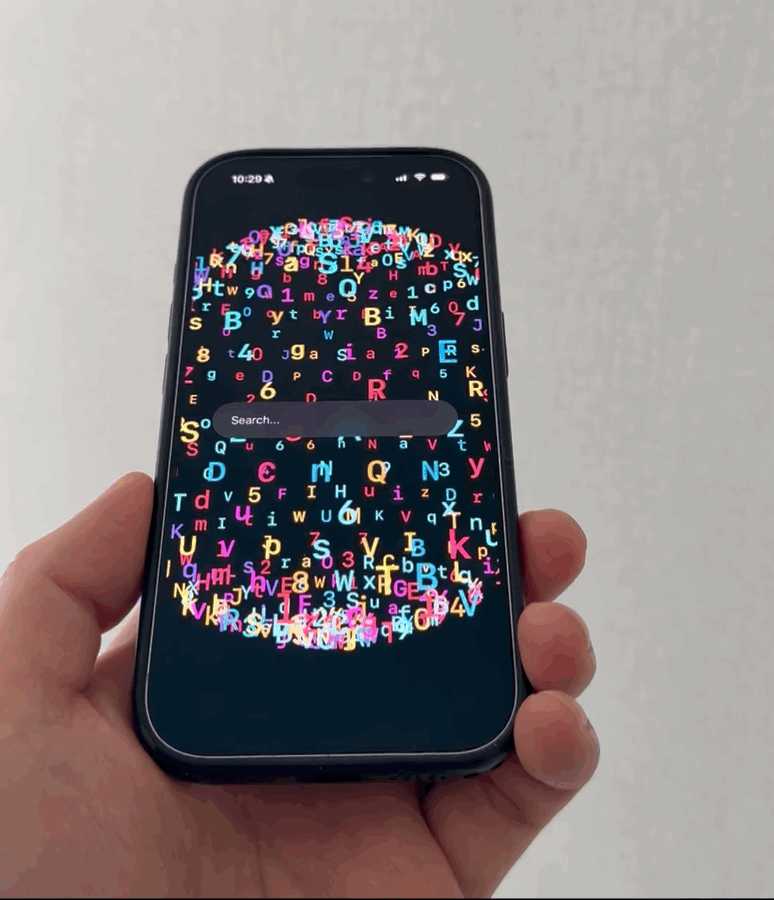

# DialKit

DialKit macOS is a package-only fork of DialKit that moves the control surface out of the app being tuned.

There is no separate `DialKit macOS.app` download. Add this repository as a Swift Package dependency, link the debug agent into the app target, then run the standalone macOS inspector from the package source with SwiftPM.

The target app keeps the live `DialPanelState` values, but it does not need to mount `DialRoot`, a drawer, a floating button, or any other DialKit UI. In debug builds, the app starts a tiny `DialKitAgent`; the `dialkit-macos` companion process renders the inspector on the Mac and sends value changes back to the running app.

## Package-Only Install Flow

Add this repository as a Swift Package dependency in Xcode:

```text
https://github.com/mikelikesdesign/dialkit-macos
```

Link these package products to the app target:

- `DialKit`
- `DialKitAgent`

Start the agent in debug builds:

```swift
import DialKit
#if DEBUG
import DialKitAgent
#endif
import SwiftUI

@main
struct MyApp: App {
    init() {
        #if DEBUG
        DialKitAgent.shared.start(appName: "MyApp")
        #endif
    }

    var body: some Scene {
        WindowGroup {
            ContentView()
        }
    }
}
```

For isolated Xcode previews, also start the agent inside the preview because `App.init()` may not run:

```swift
#Preview {
    ContentView()
        .task {
            #if DEBUG
            DialKitAgent.shared.start(appName: "ContentView Preview")
            #endif
        }
}
```

Use `dial.values` as the source of truth in your UI exactly as before. The difference is that you do not add `DialRoot` to the screen:

```swift
struct CardPreview: View {
    @StateObject private var dial = DialPanelState(
        name: "Card",
        initial: CardModel(),
        controls: [
            .text("title", keyPath: \.title),
            .slider("cornerRadius", keyPath: \.cornerRadius, range: 0...48, step: 1),
            .toggle("isEnabled", keyPath: \.isEnabled)
        ]
    )

    var body: some View {
        RoundedRectangle(cornerRadius: dial.values.cornerRadius)
            .overlay {
                Text(dial.values.title)
            }
    }
}
```

Run the standalone macOS inspector from this package:

```sh
cd /path/to/dialkit-macos
swift run dialkit run
```

You can also run the inspector executable directly:

```sh
swift run dialkit-macos
```

Then open the simulator or resume the Xcode Preview. The preview/app connects to the inspector, and edits made in the macOS window update the running UI.

The helper CLI also includes an install preflight command:

```sh
swift run dialkit install --project MyApp.xcodeproj --target MyApp
```

Today this validates the project/target and prints the debug-only wiring. The next step is for this command to patch the Xcode project automatically by linking `DialKit` and `DialKitAgent`, adding the bootstrap source, and optionally adding a debug-only inspector launch phase.

Current transport:

- the macOS inspector listens on `127.0.0.1:44777`
- the debug agent reconnects automatically
- this is intended first for iOS Simulator and local macOS app tuning
- physical-device discovery is not implemented yet

## Credit

This Swift package is based on the original [DialKit repository](https://github.com/joshpuckett/dialkit) by [Josh Puckett](https://github.com/joshpuckett).

## Requirements

- iOS 17 and later
- macOS 14 and later for local package builds and `swift test`
- SwiftUI
- A model type that conforms to `Codable` and `Equatable`

## Installation

Add this repository as a Swift Package dependency in Xcode, then import `DialKit` in your app.

```swift
import DialKit
```

### Using DialKit from UIKit

DialKit's UI is built with SwiftUI, but UIKit apps can still use it by embedding `DialRoot` in a small `UIHostingController` bridge.

A UIKit integration detail:

If you pin a full-screen `UIHostingController` over an interaction-heavy UIKit screen, the overlay can intercept touches even when the drawer is visually closed. For UIKit, there are two recommended patterns depending on the kind of screen you are building.

#### Option 1: Host-Controlled Drawer (Recommended for interaction-heavy screens)

Use the binding-driven initializer, disable the built-in FAB, and open the drawer from your own UIKit button or gesture. This is the safest option for drawing, scrubbing, camera gestures, games, or any custom touch surface.

```swift
import Combine
import DialKit
import SwiftUI
import UIKit

struct CardModel: Codable, Equatable {
    var title = "Card"
    var cornerRadius = 24.0
    var isEnabled = true
}

@MainActor
final class DialPresentationBridge: ObservableObject {
    @Published var isPresented = false
}

private struct DialDrawerOverlay: View {
    @ObservedObject var presentation: DialPresentationBridge

    var body: some View {
        DialRoot(
            position: .bottomRight,
            storageID: "card-preview",
            showsFAB: false,
            isPresented: $presentation.isPresented
        )
    }
}

final class CardViewController: UIViewController {
    private let presentationBridge = DialPresentationBridge()
    private var cancellables: Set<AnyCancellable> = []

    private let dial = DialPanelState(
        name: "Card",
        initial: CardModel(),
        controls: [
            .text("title", keyPath: \.title),
            .slider("cornerRadius", keyPath: \.cornerRadius, range: 0.0...48.0, step: 1.0),
            .toggle("isEnabled", keyPath: \.isEnabled)
        ]
    )

    private lazy var dialHost = UIHostingController(
        rootView: DialDrawerOverlay(presentation: presentationBridge)
    )

    override func viewDidLoad() {
        super.viewDidLoad()

        addChild(dialHost)
        dialHost.view.frame = view.bounds
        dialHost.view.backgroundColor = .clear
        dialHost.view.autoresizingMask = [.flexibleWidth, .flexibleHeight]
        view.addSubview(dialHost.view)
        dialHost.didMove(toParent: self)

        dial.$values
            .receive(on: DispatchQueue.main)
            .sink { [weak self] values in
                self?.apply(values)
            }
            .store(in: &cancellables)
    }

    @objc
    private func openDial() {
        presentationBridge.isPresented = true
    }

    private func apply(_ values: CardModel) {
        // Update your UIKit view hierarchy from dial.values.
    }
}
```

#### Option 2: Built-in FAB (Use a passthrough container)

If you want DialKit's built-in FAB in a UIKit app, keep `DialRoot` mounted but place the hosting view inside a passthrough container.

When the drawer is closed, the container should let non-interactive overlay space fall through to UIKit.
When the drawer is open, the container should stop passing touches through so backdrop tap-to-dismiss and drag-to-dismiss still work.

```swift
import Combine
import DialKit
import SwiftUI
import UIKit

struct CardModel: Codable, Equatable {
    var title = "Card"
    var cornerRadius = 24.0
    var isEnabled = true
}

@MainActor
final class DialPresentationBridge: ObservableObject {
    @Published var isPresented = false
}

private struct DialFABOverlay: View {
    @ObservedObject var presentation: DialPresentationBridge

    var body: some View {
        DialRoot(
            position: .bottomRight,
            storageID: "card-preview",
            showsFAB: true,
            isPresented: $presentation.isPresented
        )
    }
}

final class PassthroughHostingContainerView: UIView {
    weak var hostedView: UIView?
    var allowsPassthrough = true

    override func hitTest(_ point: CGPoint, with event: UIEvent?) -> UIView? {
        guard allowsPassthrough else {
            return super.hitTest(point, with: event)
        }

        guard
            let hostedView,
            !isHidden,
            alpha > 0.01,
            isUserInteractionEnabled
        else {
            return nil
        }

        let hostedPoint = convert(point, to: hostedView)
        return interactiveHit(in: hostedView, at: hostedPoint, with: event)
    }

    private func interactiveHit(in view: UIView, at point: CGPoint, with event: UIEvent?) -> UIView? {
        guard
            !view.isHidden,
            view.alpha > 0.01,
            view.isUserInteractionEnabled,
            view.point(inside: point, with: event)
        else {
            return nil
        }

        for subview in view.subviews.reversed() {
            let subviewPoint = view.convert(point, to: subview)
            if let hitView = interactiveHit(in: subview, at: subviewPoint, with: event) {
                return hitView
            }
        }

        guard view !== hostedView else {
            return nil
        }

        if view is UIControl || view is UIScrollView {
            return view
        }

        return !(view.gestureRecognizers?.isEmpty ?? true) ? view : nil
    }
}

final class CardViewController: UIViewController {
    private let presentationBridge = DialPresentationBridge()
    private let dialContainerView = PassthroughHostingContainerView()
    private var cancellables: Set<AnyCancellable> = []

    private let dial = DialPanelState(
        name: "Card",
        initial: CardModel(),
        controls: [
            .text("title", keyPath: \.title),
            .slider("cornerRadius", keyPath: \.cornerRadius, range: 0.0...48.0, step: 1.0),
            .toggle("isEnabled", keyPath: \.isEnabled)
        ]
    )

    private lazy var dialHost = UIHostingController(
        rootView: DialFABOverlay(presentation: presentationBridge)
    )

    override func viewDidLoad() {
        super.viewDidLoad()

        presentationBridge.$isPresented
            .receive(on: DispatchQueue.main)
            .sink { [weak self] isPresented in
                self?.dialContainerView.allowsPassthrough = !isPresented
            }
            .store(in: &cancellables)

        dialContainerView.translatesAutoresizingMaskIntoConstraints = false
        dialContainerView.backgroundColor = .clear
        view.addSubview(dialContainerView)

        NSLayoutConstraint.activate([
            dialContainerView.leadingAnchor.constraint(equalTo: view.leadingAnchor),
            dialContainerView.trailingAnchor.constraint(equalTo: view.trailingAnchor),
            dialContainerView.topAnchor.constraint(equalTo: view.topAnchor),
            dialContainerView.bottomAnchor.constraint(equalTo: view.bottomAnchor)
        ])

        addChild(dialHost)
        dialHost.view.translatesAutoresizingMaskIntoConstraints = false
        dialHost.view.backgroundColor = .clear
        dialContainerView.hostedView = dialHost.view
        dialContainerView.addSubview(dialHost.view)

        NSLayoutConstraint.activate([
            dialHost.view.leadingAnchor.constraint(equalTo: dialContainerView.leadingAnchor),
            dialHost.view.trailingAnchor.constraint(equalTo: dialContainerView.trailingAnchor),
            dialHost.view.topAnchor.constraint(equalTo: dialContainerView.topAnchor),
            dialHost.view.bottomAnchor.constraint(equalTo: dialContainerView.bottomAnchor)
        ])

        dialHost.didMove(toParent: self)
    }
}
```

#### Important Notes

- Add the hosting controller high enough in your UIKit hierarchy for the drawer or FAB overlay to sit above your content.
- `dial.values` remains the source of truth for your tuned values.
- Keep `DialPanelState` alive for as long as you want the panel to exist.
- If UIKit needs to drive `isPresented`, prefer an `ObservableObject` bridge over a plain stored `Bool`, so SwiftUI sees external state changes reliably.
- If you mount and unmount the SwiftUI host from UIKit and observe stale drawer state across repeated open/close cycles, recreating the `UIHostingController` per presentation is safer than reusing one that has already driven the drawer lifecycle.

## Core Concepts

DialKit has three main pieces:

- `DialPanelState<Model>`: owns the editable values for one panel
- `DialControl<Model>`: describes the controls that should be shown for that model
- `DialRoot`: renders every registered panel from the shared global store

The typical flow is:

1. Define a `Model` that contains the values you want to tune.
2. Create a `DialPanelState<Model>` with an initial value and a list of controls.
3. Bind your UI directly to `dial.values`.
4. Add a single `DialRoot` near the top of your screen hierarchy.

## Quick Start

```swift
import DialKit
import SwiftUI

struct CardModel: Codable, Equatable {
    var title = "Card"
    var cornerRadius = 24.0
    var isEnabled = true
    var fill = "#F97316"
    var style = "glass"
    var spring: DialSpring = .default
    var transition: DialTransition = .default
}

struct CardPreview: View {
    @StateObject private var dial = DialPanelState(
        name: "Card",
        initial: CardModel(),
        controls: [
            .text("title", keyPath: \.title),
            .slider("cornerRadius", keyPath: \.cornerRadius, range: 0.0...48.0, step: 1.0),
            .toggle("isEnabled", keyPath: \.isEnabled),
            .color("fill", keyPath: \.fill),
            .select("style", keyPath: \.style, options: ["glass", "solid"]),
            .group(
                "motion",
                children: [
                    .spring("spring", keyPath: \.spring),
                    .transition("transition", keyPath: \.transition),
                    .action("shuffle")
                ]
            )
        ],
        onAction: { path in
            print("Dial action:", path)
        }
    )

    var body: some View {
        ZStack {
            RoundedRectangle(cornerRadius: dial.values.cornerRadius)
                .fill(dial.values.isEnabled ? .orange : .gray)
                .overlay {
                    Text(dial.values.title)
                        .foregroundStyle(.white)
                }
                .padding(40)

            DialRoot(
                position: .bottomRight,
                defaultOpen: false,
                mode: .drawer,
                storageID: "card-preview"
            )
        }
    }
}
```

A few important details:

- Keep `DialPanelState` alive for as long as you want the panel to exist. In SwiftUI that usually means `@StateObject`.
- `dial.values` is the source of truth for the tuned values.
- You only need one `DialRoot` to render every active panel.
- In drawer mode, `DialRoot` shows a draggable FAB by default and opens a mobile bottom drawer when tapped.
- If you do not want the FAB on screen, use the binding-driven drawer initializer and open DialKit from your own control or gesture.

## Public API Overview

### `DialRoot`

Default FAB-driven drawer setup:

```swift
DialRoot(
    position: .bottomRight,
    defaultOpen: false,
    mode: .drawer,
    storageID: "default"
)
```

Host-controlled drawer setup:

```swift
@State private var isDialPresented = false

DialRoot(
    position: .bottomRight,
    storageID: "default",
    showsFAB: false,
    isPresented: $isDialPresented
)
```

Supported positions:

- `.topRight`
- `.topLeft`
- `.bottomRight`
- `.bottomLeft`

In drawer mode, `position` is the initial FAB anchor, not a panel alignment.

Supported modes:

- `.drawer`: draggable FAB + mobile bottom drawer
- `.inline`: always-expanded panel rendered in place

Drawer behavior:

- `defaultOpen: false` starts closed with only the FAB visible when you use the legacy drawer initializer
- `defaultOpen: true` starts with the drawer open at the medium height
- the mobile drawer can be dragged between medium and tall states, then dragged down to dismiss
- short control lists size the drawer to content; longer lists scroll once the drawer reaches its height cap
- `isPresented` makes the host app the source of truth for drawer visibility
- when `isPresented` changes to `true`, DialKit opens the drawer at the medium height
- when `isPresented` changes to `false`, DialKit dismisses the drawer
- user-driven dismissals also write `false` back into the binding
- `showsFAB` defaults to `false` on the binding-driven initializer; set it to `true` if you want both your own trigger and the built-in FAB
- `storageID` namespaces the persisted FAB position only when the FAB is enabled

The package declares macOS support so it can be built and tested from a Mac host, but `drawer` mode is currently iPhone-first. A dedicated iPad presentation is deferred for now.

### Custom Triggers

You can open DialKit from your own app UI by toggling a Boolean binding. In the demo, the drawer opens with a triple tap gesture instead of the default FAB.



```swift
import DialKit
import SwiftUI

struct CardModel: Codable, Equatable {
    var title = "Card"
    var cornerRadius = 24.0
    var isEnabled = true
}

struct CardPreview: View {
    @StateObject private var dial = DialPanelState(
        name: "Card",
        initial: CardModel(),
        controls: [
            .text("title", keyPath: \.title),
            .slider("cornerRadius", keyPath: \.cornerRadius, range: 0.0...48.0, step: 1.0),
            .toggle("isEnabled", keyPath: \.isEnabled)
        ]
    )
    @State private var isDialPresented = false

    var body: some View {
        ZStack(alignment: .topTrailing) {
            RoundedRectangle(cornerRadius: dial.values.cornerRadius)
                .fill(dial.values.isEnabled ? .orange : .gray)
                .overlay {
                    Text(dial.values.title)
                        .foregroundStyle(.white)
                }
                .padding(40)

            Button("Tune Card") {
                isDialPresented = true
            }
            .buttonStyle(.borderedProminent)
            .padding()

            DialRoot(
                position: .bottomRight,
                storageID: "card-preview",
                showsFAB: false,
                isPresented: $isDialPresented
            )
        }
    }
}
```

Any SwiftUI interaction can drive the same binding. In the demo, a triple-tap gesture flips `isDialPresented` to `true`; you can also use a toolbar button, a custom overlay handle, a long-press gesture, or any other SwiftUI interaction that opens the drawer.

### `DialPanelState<Model>`

```swift
DialPanelState(
    name: "Card",
    initial: CardModel(),
    controls: [...],
    onAction: { path in ... }
)
```

Public behavior:

- `values`: the current tuned model
- `presets`: saved presets for that panel
- `activePresetID`: currently loaded preset, if any
- `controls`: the current control definitions
- `configure(name:initial:controls:)`: update the control config at runtime
- `savePreset(named:)`
- `loadPreset(id:)`
- `clearActivePreset()`
- `deletePreset(id:)`
- `copyInstructionText()`

### `DialStore`

```swift
DialStore.shared
```

`DialPanelState` instances automatically register with the shared global store, and `DialRoot` renders whatever is currently active from that store. Most apps do not need to talk to `DialStore` directly, but it is public.

### `DialPreset<Model>`

`presets` is an array of public `DialPreset<Model>` values. Each preset contains:

- `id`
- `name`
- `values`

## Defining Controls

DialKit uses writable key paths into your model. Each control gets a path string and a key path.

```swift
[
    .slider("opacity", keyPath: \.opacity, range: 0.0...1.0, step: 0.05),
    .slider("blur", keyPath: \.blur, range: 0.0...40.0, step: 1.0, unit: "pt"),
    .toggle("enabled", keyPath: \.enabled),
    .text("title", keyPath: \.title, placeholder: "Title"),
    .color("fill", keyPath: \.fill),
    .select(
        "style",
        keyPath: \.style,
        options: [
            DialOption("glass", label: "Glass"),
            DialOption("solid", label: "Solid")
        ]
    ),
    .spring("spring", keyPath: \.spring),
    .transition("transition", keyPath: \.transition),
    .group("motion", collapsed: false, children: [...]),
    .action("shuffle")
]
```

Supported controls:

- `slider`: numeric values backed by `Double`, `Float`, `CGFloat`, or `Int`, with optional `step` and `unit`
- `toggle`: `Bool`
- `text`: `String`
- `color`: `String` hex color values
- `select`: `String` with either `[String]` or `[DialOption]`
- `spring`: `DialSpring`
- `transition`: `DialTransition`
- `group`: nested folders of controls
- `action`: callback-only button routed through `onAction`

Paths are also used to generate stable action identifiers. A nested action inside `group("motion")` with `action("shuffle")` is delivered as `motion.shuffle`.

### `DialOption`

`DialOption` is a public helper type for labeled select options:

```swift
DialOption("glass", label: "Glass")
DialOption(value: "spring-physics", label: "Physics Spring")
```

Use `[String]` when the stored value and visible label should match. Use `[DialOption]` when you want a separate stored value and display label.

## Working With Multiple Panels

Multiple panel states can exist at the same time. They automatically register with the shared `DialStore`.

```swift
struct MultiPreview: View {
    @StateObject private var cardDial = DialPanelState(
        name: "Card",
        initial: CardModel(),
        controls: CardModel.controls
    )

    @StateObject private var shadowDial = DialPanelState(
        name: "Shadow",
        initial: ShadowModel(),
        controls: ShadowModel.controls
    )

    var body: some View {
        ZStack {
            PreviewSurface(card: cardDial.values, shadow: shadowDial.values)
            DialRoot(storageID: "multi-preview")
        }
    }
}
```

Drawer mode uses one shared drawer. If multiple panels are active, DialKit shows a picker in the drawer header and renders the selected panel. Inline mode renders all active panels in place.

## Presets, Base State, and Copy

Each panel supports in-memory presets.

- When no preset is selected, edits update the panel's base values.
- When a preset is active, edits automatically update that preset.
- `clearActivePreset()` restores the current base values.
- `copyInstructionText()` returns a prompt block plus JSON, not raw JSON alone.

The built-in UI already exposes preset save/load/delete and copy actions.

## Actions

Action controls are useful when you want the panel to trigger app logic that is not a direct key-path write.

```swift
let dial = DialPanelState(
    name: "Card",
    initial: CardModel(),
    controls: [
        .group(
            "actions",
            children: [
                .action("shuffle"),
                .action("resetLayout")
            ]
        )
    ],
    onAction: { path in
        switch path {
        case "actions.shuffle":
            print("shuffle")
        case "actions.resetLayout":
            print("reset")
        default:
            break
        }
    }
)
```

## Springs and Transitions

DialKit includes two animation-oriented value types.

### `DialSpring`

```swift
.time(duration: 0.35, bounce: 0.24)
.physics(stiffness: 200, damping: 25, mass: 1)
```

The spring control can switch between time-based and physics-based editing.

Useful public helpers:

```swift
let spring = DialSpring.default
let physics = spring.resolvedPhysics
let faster = spring.updatingTime(duration: 0.2)
let heavier = spring.updatingPhysics(mass: 1.5)
```

### `DialTransition`

```swift
.easing(duration: 0.3, bezier: .standard)
.spring(.default)
```

The transition control supports:

- easing curves via `DialBezier`
- time-based spring mode
- physics spring mode

It also exposes a public mode-switching helper:

```swift
let easing = DialTransition.default.switching(to: .easing)
let physics = DialTransition.default.switching(to: .advanced)
```

## Colors

Color controls are stored as strings for parity with the upstream DialKit model.

Supported formats:

- `#RGB`
- `#RRGGBB`
- `#RRGGBBAA`

Example:

```swift
var fill = "#F97316"
```

DialKit converts these values to SwiftUI colors internally for the built-in control UI, and the built-in color control preserves alpha when you use `#RRGGBBAA`.

## Runtime Reconfiguration

You can swap the control schema at runtime by calling `configure(name:initial:controls:)` on an existing panel state.

```swift
dial.configure(
    name: "Card",
    initial: CardModel(),
    controls: CardModel.advancedControls
)
```

When you reconfigure a panel:

- compatible current values are preserved
- invalid values are clamped or reset to fallback values
- existing presets are normalized to the new control schema

## Tips

- Add `DialRoot` close to the top of your screen hierarchy so the drawer and optional FAB can overlay your content.
- Use a unique `storageID` per screen if you want each screen to remember its own FAB position.
- Use `inline` mode for settings screens, inspectors, or debug panels that should always stay visible.
- The built-in slider UI supports both tap-to-edit values and direct drag interaction with step haptics on iPhone.
- Keep your model small and focused. DialKit works best when each panel represents a coherent group of values.
- Prefer stable path names because they become labels, nested control identifiers, and action paths.

## Features

- Config-driven controls keyed by writable key paths into your model
- Shared global store for multiple panels
- Optional draggable FAB with persisted position per `storageID`
- Mobile drawer presentation plus inline presentation
- Content-sized iPhone drawer with medium/tall drag states and shared multi-panel picker
- Presets with base-state restore and active-preset autosave
- Built-in copy action, color picker, tap-to-edit sliders, drag guide marks, and slider step haptics
- Nested groups, spring controls, transition controls, actions, text, toggle, color, select, and slider controls
